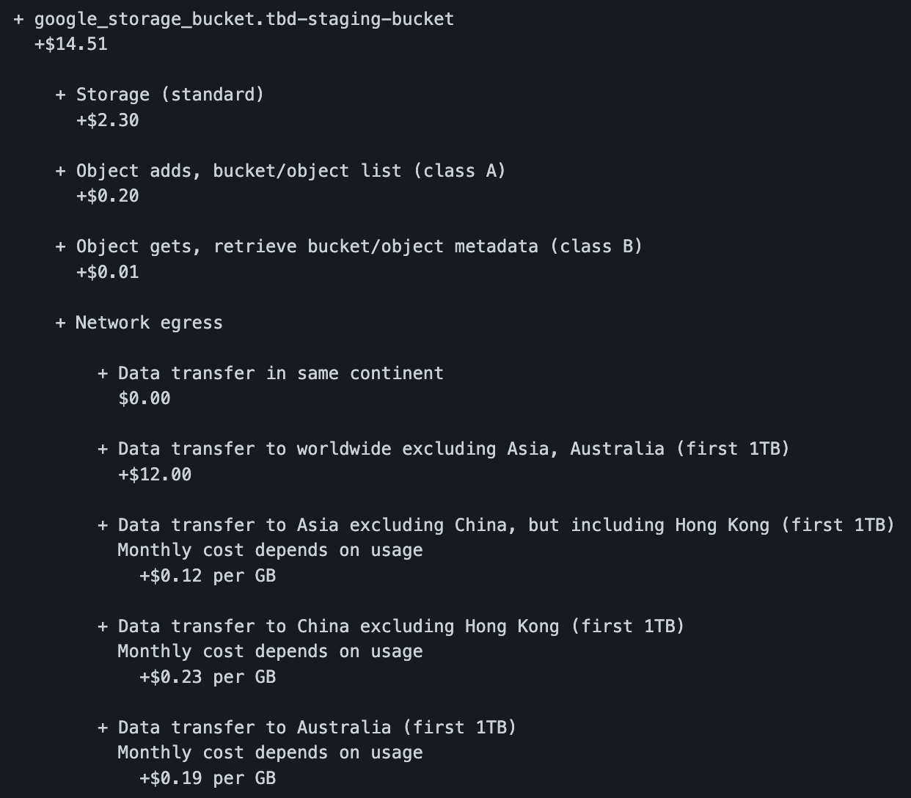
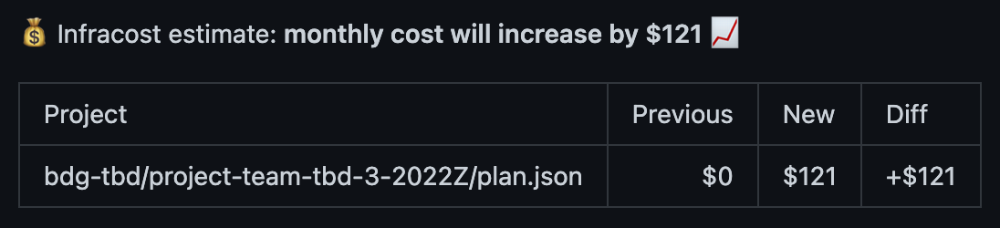

# Dokumentacja

## Etap 1b

**Co wykonywane jest w pierwszym kroku "Set up job"?**

W pierwszym kroku "Set up job" sprawdzana jest wersja systemu operacyjnego runnera, sprawdzane są uprawnienia i pochodzenie tokenu dającego dostęp do API GitHuba, a następnie akumulowane są informacje o wszystkich potrzebnych akcjach, których definicje na koniec są pobierane (np. `actions/checkout@v2`).

### TF plan

**Które zmienne trzeba było dodać?**

Trzeba było dodać:
* `bucket` w `env/dev/backend.tfvars`
* `project_name` w `env/dev/project.tfvars`
* `TF_VAR_billing_account`
* `TF_VAR_group_id`
* `TF_VAR_tbd_semester`

Trzeba było też usunąć `github-token: ${{ secrets.GH_TOKEN }}` z kroku `uses: actions/github-script@v6` pomiędzy krokami `name: Terraform Plan`, ponieważ zgodnie z https://github.com/actions/github-script:

> Note that `github-token` is optional in this action, and the input is there in case you need to use a non-default token.
> 
> By default, github-script will use the token provided to your workflow.

### Lintint TF

**Napisz, co trzeba było wykonać**

Trzeba było z pliku `variables.tf` usunąć następujące (nieużywane) zmienne:
* `zone`
* `group_id`
* `billing_account`
* `environment`

### Infracost

Wyliczony koszt: $106

Najdroższy składnik:
`module.gke.google_container_cluster.primary` > `Cluster management fee`: $73.00

Najtańszy składnik:
`google_storage_bucket.tbd-staging-bucket`, ponieważ *Monthly cost depends on usage*, a zatem jego koszt nie jest uwzględniany w podsumowaniu, ponieważ zależy on od zużycia (ilość zapisanych / przesłanych danych, liczba operacji).

Darmowe składniki:
```
∙ 10 were free:
  ∙ 3 x google_project_iam_member
  ∙ 3 x google_project_service
  ∙ 3 x google_storage_bucket_object
  ∙ 1 x google_service_account
```

**.infracost-usage.yml**

Całkowity koszt wzrósł z $106 do $109, ponieważ w pliku `.infracost-usage.yml` zostały podane szacunkowe (częściowe) dane dla zużycia `google_storage_bucket.tbd-staging-bucket`. Zabrakło jednak informacji o `monthly_egress_data_transfer_gb`, które zostały uzupełnione w następujący sposób:

```
monthly_egress_data_transfer_gb:  # Monthly data transfer from Cloud Storage to the following, in GB:
      same_continent: 1000 # Same continent.
      worldwide: 100       # Worldwide excluding Asia, Australia.
      asia: 0              # Asia excluding China, but including Hong Kong.
      china: 0             # China excluding Hong Kong.
      australia: 0         # Australia.
```

`same_continent` dotyczy zapewne przepływu danych z Cloud Storage buckets do innych usług Google Cloud. Został oszacowany na 1000 GB, ponieważ prawdopodobnie dane będą głównie odczytywane przez np. joby Sparkowe.

`worldwide` dotyczy wysyłania danych poza Google Cloud, czyli np. pobierania lokalnie na komputer. Na wszelki wypadek zostało to oszacowane na 100 GB, gdyby zaszła potrzeba pobrania części danych np. w celu debugowania lub dokumentacji.

Niestety w porównaniu z danymi na stronie https://cloud.google.com/storage/pricing#network-pricing, dostępne zmienne nie pozwalają na zbyt szczegółowe szacowanie.

**Ostateczna estymacja kosztów `tbd-staging-bucket`**



**Ostateczna estymacja kosztów całej infrastruktury**




