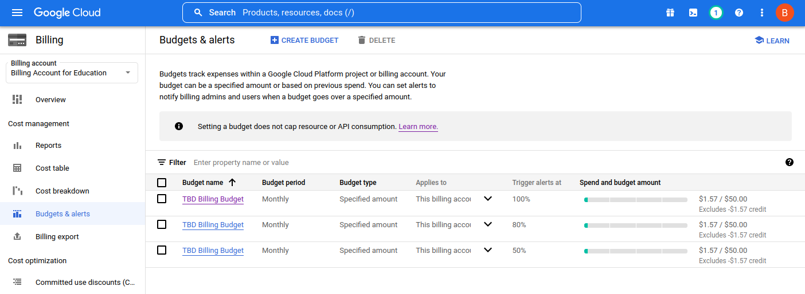

# Dokumentacja

## Etap 1a

**Jakie sposoby odwoływania się do modułów Terraform są wykorzystane w projekcie?**

Root Module -- główny moduł (projekt) wykorzystujący child modules.

Child Modules:
* Local modules -- znajdują się w `./modules`:
    * `data-generator` -- generuje plik zawierający losowe stringi.
    * `dataproc-pyspark-job` -- tworzy i konfiguruje szablon workflowu Dataprocowego zawierającego job PySparkowy.
    * `gke` -- tworzy i konfiguruje klaster Kubernetesowy oraz jego node'y. Zwraca endpoint, pod którym się znajduje, oraz jego certyfikat CA.
* Git repository:
    * `k8s-spark-operator` -- pozwala na uruchamianie aplikacji Sparkowych na Kubernetesie w łatwy i idiomatyczny sposób.

**Graf dla modułu `data-generator`**

**Graf dla modułu `dataproc-pyspark-job`**

**Graf dla modułu `gke`**

**Graf dla modułu `k8s-spark-operator`**

**Moduł monitorujący budżet**

Wszelkie czynności związane z `google_billing_budget` muszą być dokonywane przy użyciu *service account*. W przypadku *end user credentials* dostaniemy `403` z informacją `"reason": "SERVICE_DISABLED"` dla `"service": "billingbudgets.googleapis.com"`, który w rzeczywistości jest włączony.

`google_billing_budget` można skonfigurować podając wiele `threshold_rules` dla jednego resource'a, jednak nie jest możliwe użycie w takim wypadku `for_each`, a co za tym idzie, nie można poziomów dla alertów trzymać w liście.

Postanowiliśmy wykorzystać `for_each`, a także umożliwić konfigurowanie poziomów dla alertów poprzez zmienną (z domyślnymi wartościami). Skutek jest jednak taki, że w konsoli widnieją 3 różne budżety zamiast jednego z kilkoma poziomami, jednak nie powinien być to raczej problem, ponieważ cała konfiguracja jest zarządzana i modyfikowana przez Terraforma.

**Lista budżetów**

**Szczegóły budżetu**

TODO: Zaprezentuj w postaci zrzutów ekranu jak wygląda wykorzystanie budżetu po kilku dniach korzystania.

**Klaster dataproc**
